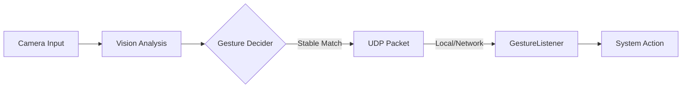

# 🖐️ GestureLink

A sophisticated gesture detection system for macOS that leverages **Computer Vision** to bridge the gap between physical movements and system actions via UDP messaging.

[](https://swift.org)
[](https://apple.com)
[](https://developer.apple.com/documentation/vision)
[](LICENSE)

---

## 🌟 Overview

GestureLink is a decoupled system designed for low-latency gesture recognition and remote triggering. It's built with modern Apple technologies including **SwiftUI**, **Combine**, and **Network.framework**.

| Component | Role | Technology |
|:---|:---|:---|
| **`GestureDetector`** | Real-time video processing & gesture analysis | `AVFoundation`, `Vision`, `SwiftUI` |
| **`GestureListener`** | Lightweight signal receiver & action execution | `Network.framework`, `Swift Concurrency` |

## 🏗️ Architecture



## 🚀 Getting Started

### Prerequisites

- **macOS Monterey 12.0+**
- **Swift 5.9+** (Xcode 15+)
- An active Camera

### The Easy Way (One Script)

Run both components simultaneously with the helper script:

```bash
chmod +x run.sh
./run.sh
```

### The Manual Way

1. **Start the Listener:**
   ```bash
   cd GestureListener
   swift run
   ```

2. **Launch the Detector:**
   ```bash
   cd GestureDetector
   swift run
   ```

## 🛠️ Supported Gestures

| Gesture | Emoji | Action Triggered |
|:---:|:---:|:---|
| **Victory** | ✌️ | `victory_detected` |
| **Thumbs Up** | 👍 | `thumbs_up_detected` |
| **Thumbs Down**| 👎 | `thumbs_down_detected` |
| **Open Palm** | ✋ | `open_palm_detected` |
| **Fist** | ✊ | `fist_detected` |

## 🧠 Technical Deep Dive

### Victory Gesture Logic
Our system identifies a Victory sign by validating:
1. **Extension**: Index and middle fingers must be above their respective MCP joints.
2. **Exclusion**: Ring, little, and thumb fingers must be retracted/curled.
3. **Geometry**: A minimum Euclidean distance (5% of viewport) between fingertips.

### Robustness via Debounce
To eliminate flickering and false positives, the `DebounceController` ensures a gesture is held for **5 consecutive frames** (~167ms @ 30fps) before any network signal is dispatched.

### Normalized Coordinate System
Vision returns landmarks in a normalized coordinate space:
- Bottom-Left: `(0, 0)`
- Top-Right: `(1, 1)`
This ensures consistent behavior regardless of resolution or aspect ratio.

## ⚙️ Configuration

- **Port Mapping**: Default is `8080`. Modify in `GestureDetectorViewModel.swift` and `main.swift`.
- **Target IP**: Default is `127.0.0.1`. The Detector UI allows real-time IP updates for cross-device control.
- **Sensitivity**: Adjust `requiredFrames` in `GestureDetectorViewModel` to change detection speed vs stability.

## 🔍 Troubleshooting

- **Camera Not Found**: Ensure no other app (Zoom, Teams) is monopolizing the camera.
- **Connection Refused**: Check if your firewall is blocking UDP port `8080`.
- **Laggy UI**: The Vision request is offloaded to a background serial queue to keep the Main Thread free for 60fps UI rendering.

---

Built with ❤️ by **Aashish Awadhani**.
